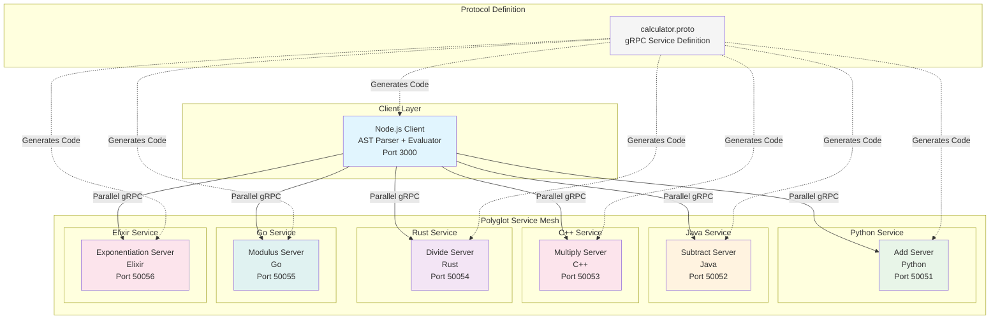
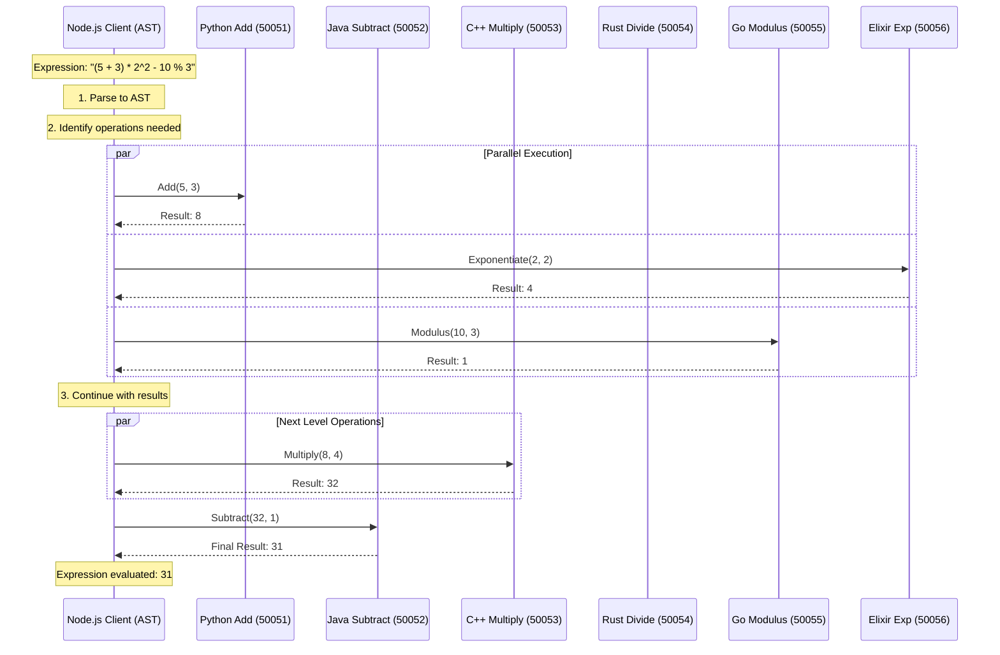
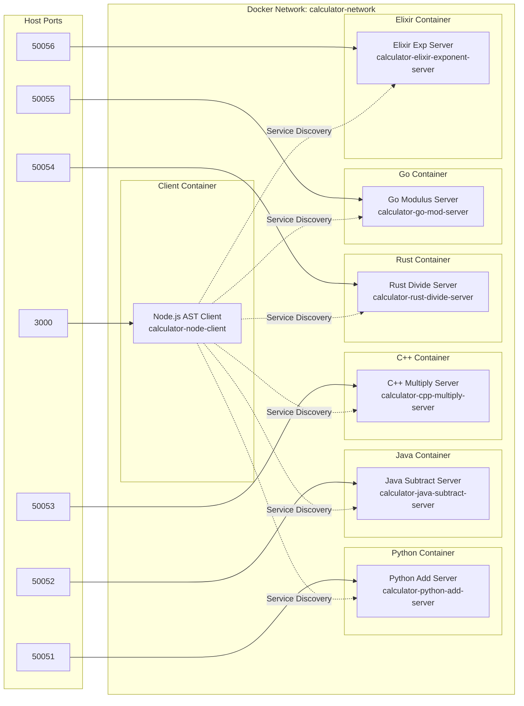
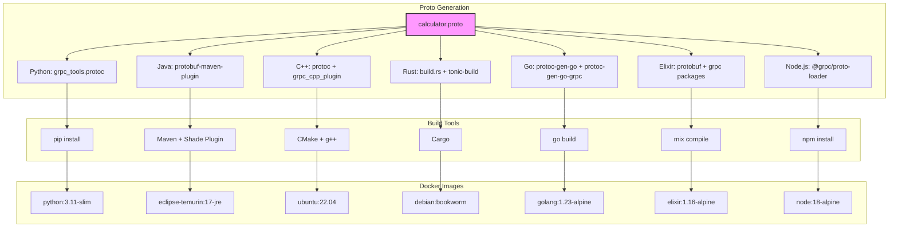

# Polyglot gRPC Calculator - Multi-Language Expression Evaluator

A sophisticated distributed calculator system built with gRPC, demonstrating **polyglot microservices architecture** across 6 programming languages. Each arithmetic operation is implemented as a separate service in a different language, with an intelligent Node.js client that parses mathematical expressions using Abstract Syntax Trees (AST) and evaluates them through parallel gRPC calls.

## 🎯 Key Features

- **6 Different Programming Languages** - Each service showcases language-specific strengths
- **AST-based Expression Parsing** - Handles complex mathematical expressions with proper precedence
- **Parallel Evaluation** - Multiple operations executed concurrently via gRPC
- **Expression Support** - Parentheses, decimals, unary minus, operator precedence
- **Container Orchestration** - Fully dockerized with docker-compose
- **Production Patterns** - Error handling, logging, proper service dependencies

## 🏗️ Architecture Overview



## 🚀 Technology Stack

| Component                 | Language | Framework/Library    | Port  | Purpose                         |
| ------------------------- | -------- | -------------------- | ----- | ------------------------------- |
| **Add Server**            | Python   | grpcio, grpcio-tools | 50051 | Addition operations             |
| **Subtract Server**       | Java     | gRPC Java, Maven     | 50052 | Subtraction operations          |
| **Multiply Server**       | C++      | gRPC C++, CMake      | 50053 | Multiplication operations       |
| **Divide Server**         | Rust     | Tonic, Tokio         | 50054 | Division operations             |
| **Modulus Server**        | Go       | gRPC Go              | 50055 | Modulus operations              |
| **Exponentiation Server** | Elixir   | gRPC Elixir          | 50056 | Exponentiation operations       |
| **AST Client**            | Node.js  | @grpc/grpc-js        | 3000  | Expression parsing & evaluation |

## 🧠 Expression Parsing & Evaluation

The Node.js client implements a sophisticated mathematical expression evaluator:

- **Tokenizer**: Breaks expressions into tokens (numbers, operators, parentheses)
- **AST Parser**: Builds Abstract Syntax Trees with proper operator precedence
- **Parallel Evaluator**: Executes operations concurrently via gRPC calls
- **Supported Features**:
  - Basic operators: `+ - * / % ^`
  - Parentheses for grouping: `(2 + 3) * 4`
  - Decimal numbers: `3.14 * 2.5`
  - Unary minus: `-5 + 10`
  - Complex expressions: `(10 + 5) * 2 - 8 / 4`

### Example Expressions

```bash
Enter expression: 2 + 3 * 4
# Parsed as: 2 + (3 * 4) = 14

Enter expression: (10 - 6) / 2 + 3^2
# Parsed as: ((10 - 6) / 2) + (3^2) = 11

Enter expression: -5.5 + 10 % 3
# Parsed as: (-5.5) + (10 % 3) = -4.5
```

## 📊 Service Communication Flow



## 🐳 Docker Architecture



## 📋 Protocol Buffer Definition

The system uses a unified Protocol Buffer definition (`calculator.proto`) that defines:

```protobuf
service Calculator {
    rpc Add(TwoNumbers) returns (Number);
    rpc Subtract(TwoNumbers) returns (Number);
    rpc Multiply(TwoNumbers) returns (Number);
    rpc Divide(TwoNumbers) returns (Number);
    rpc Modulus(TwoNumbers) returns (Number);
    rpc Exponentiate(TwoNumbers) returns (Number);
}

message TwoNumbers {
    double a = 1;
    double b = 2;
}

message Number {
    double result = 1;
}
```

## 🛠️ Build System Architecture



## 🚦 Getting Started

### Prerequisites

- Docker & Docker Compose
- Git

### Quick Start

1. **Clone the repository**

   ```bash
   git clone <repository-url>
   cd Calculator
   ```

2. **Build and run the entire system**

   ```bash
   docker-compose up --build
   ```

3. **Interactive client usage**
   ```
   Polyglot gRPC Calculator (AST + parallel eval via generated stubs)
   supported: + (python) - (java) * (cpp) / (rust) % (go) ^ (elixir), parentheses, decimals, unary minus
   Enter expression: (5 + 3) * 2^2 - 10 % 3
   Result: 31
   ```

### Individual Service Development

#### Python Add Server

```bash
cd python
pip install grpcio grpcio-tools
python -m grpc_tools.protoc -I../proto --python_out=. --grpc_python_out=. ../proto/calculator.proto
python add_server.py
```

#### Java Subtract Server

```bash
cd java
mvn clean compile
mvn exec:java -Dexec.mainClass="subtract.SubtractServer"
```

#### C++ Multiply Server

```bash
cd cpp
mkdir -p build && cd build
cmake ..
make
./multiply_server
```

#### Rust Divide Server

```bash
cd rust
cargo build --release
cargo run
```

#### Go Modulus Server

```bash
cd go
go build -o server mod_server.go
./server
```

#### Elixir Exponentiation Server

```bash
cd elixir
mix deps.get
mix compile
mix start
```

#### Node.js AST Client

```bash
cd node
npm install
npm start
# Then enter mathematical expressions interactively
```

## 📁 Project Structure

```
Calculator/
├── proto/
│   ├── calculator.proto           # gRPC service definition
│   └── generate_stubs.ps1         # Cross-platform stub generation
├── python/
│   ├── add_server.py              # Python addition service
│   ├── Dockerfile
│   └── generated/                 # Generated Python gRPC code
├── java/
│   ├── src/main/java/subtract/    # Java subtraction service
│   ├── pom.xml                    # Maven configuration
│   └── Dockerfile
├── cpp/
│   ├── multiply_server.cc         # C++ multiplication service
│   ├── CMakeLists.txt
│   ├── build.ps1                  # Windows build script
│   ├── Dockerfile
│   └── generated/                 # Generated C++ gRPC code
├── rust/
│   ├── src/main.rs                # Rust division service
│   ├── build.rs                   # Build script for proto generation
│   ├── Cargo.toml
│   └── Dockerfile
├── go/
│   ├── mod_server.go              # Go modulus service
│   ├── go.mod                     # Go module definition
│   ├── Dockerfile
│   └── generated/                 # Generated Go gRPC code
├── elixir/
│   ├── lib/
│   │   ├── server.ex              # Elixir application & endpoint
│   │   ├── pow_server.ex          # Exponentiation service implementation
│   │   └── calculator.pb.ex       # Generated protobuf code
│   ├── mix.exs                    # Elixir project configuration
│   └── Dockerfile
├── node/
│   ├── src/
│   │   ├── cli.js                 # Interactive command-line interface
│   │   ├── tokenize.js            # Expression tokenizer
│   │   ├── parse.js               # AST parser
│   │   ├── eval.js                # AST evaluator with gRPC calls
│   │   ├── precedence.js          # Operator precedence definitions
│   │   └── services.js            # gRPC service clients
│   ├── package.json
│   ├── Dockerfile
│   └── generated/                 # Generated Node.js gRPC code
├── docker-compose.yml             # Container orchestration
├── test.js                        # Integration test script
└── README.md                      # This file
```

## 🔧 Configuration Details

### Service Dependencies

The system uses Docker Compose with dependency management:

- Java Subtract depends on Python Add
- C++ Multiply depends on Java Subtract
- Rust Divide depends on C++ Multiply
- Go Modulus depends on Rust Divide
- Elixir Exponentiation depends on Go Modulus
- Node.js Client depends on all servers

### Network Configuration

- **Docker Network**: `calculator-network`
- **Service Discovery**: Container names as hostnames
- **Protocol**: HTTP/2 with gRPC
- **Load Balancing**: Not implemented (single instance per service)

## 🧪 Testing

### Integration Testing

Run the automated test script:

```bash
node test.js
```

### Expected Results for Complex Expressions

```
✅ Simple: 2 + 3 = 5 (Python)
✅ Precedence: 2 + 3 * 4 = 14 (Python + C++)
✅ Parentheses: (2 + 3) * 4 = 20 (Python + C++)
✅ Decimals: 3.14 * 2 = 6.28 (C++)
✅ Modulus: 10 % 3 = 1 (Go)
✅ Power: 2^3 = 8 (Elixir)
✅ Complex: (5 + 3) * 2^2 - 10 % 3 = 31 (All services)
```

## 🚨 Error Handling

Each service implements robust error handling:

- **Input Validation**: Parameter checking and type validation
- **Division by Zero**: Rust service returns appropriate gRPC error status
- **Invalid Expressions**: Client validates expressions before parsing
- **Connection Timeouts**: Client-side timeout handling for all services
- **Service Discovery**: Container-to-container communication with retry logic
- **Parsing Errors**: AST parser handles malformed expressions gracefully

## 🔐 Security Considerations

- **Current**: Insecure gRPC (for development and demonstration)
- **Production Ready**: Would need TLS/SSL encryption for all gRPC channels
- **Authentication**: No auth implemented (add JWT/OAuth for production)
- **Network**: Services isolated in Docker network (calculator-network)
- **Input Validation**: All services validate inputs to prevent injection attacks

## 📈 Performance Characteristics

| Service | Language | Startup Time | Memory Usage | Binary Size | Concurrency Model  |
| ------- | -------- | ------------ | ------------ | ----------- | ------------------ |
| Python  | Python   | ~2s          | ~50MB        | N/A         | Threading          |
| Java    | Java     | ~3s          | ~100MB       | ~15MB JAR   | Thread Pool        |
| C++     | C++      | ~1s          | ~10MB        | ~2MB        | Thread Pool        |
| Rust    | Rust     | ~1s          | ~5MB         | ~8MB        | Async (Tokio)      |
| Go      | Go       | ~1s          | ~15MB        | ~12MB       | Goroutines         |
| Elixir  | Elixir   | ~2s          | ~25MB        | N/A         | Actor Model (BEAM) |
| Node.js | Node.js  | ~1s          | ~30MB        | N/A         | Event Loop         |

## 🎓 Learning Outcomes

This project demonstrates:

### Polyglot Programming

- **Language Strengths**: Each language showcases its unique strengths
  - Python: Simplicity and rapid development
  - Java: Enterprise robustness and tooling
  - C++: Performance and system-level control
  - Rust: Memory safety and concurrency
  - Go: Simplicity and built-in concurrency
  - Elixir: Fault tolerance and distributed systems
  - Node.js: Event-driven architecture and JavaScript ecosystem

### Distributed Systems Concepts

- **Service Mesh**: Inter-service communication patterns
- **Protocol Buffers**: Language-agnostic serialization
- **gRPC**: Modern RPC framework with HTTP/2
- **Container Orchestration**: Docker Compose service management
- **Dependency Management**: Service startup ordering

### Computer Science Fundamentals

- **Abstract Syntax Trees**: Expression parsing and evaluation
- **Operator Precedence**: Mathematical expression handling
- **Parallel Processing**: Concurrent evaluation of independent operations
- **Client-Server Architecture**: Request-response patterns

## 🔮 Future Enhancements

- **C# Service**: Add power operations (`**`) using .NET
- **Kubernetes Deployment**: Production-ready orchestration

---

**Built to demonstrate the power of polyglot microservices architecture**
